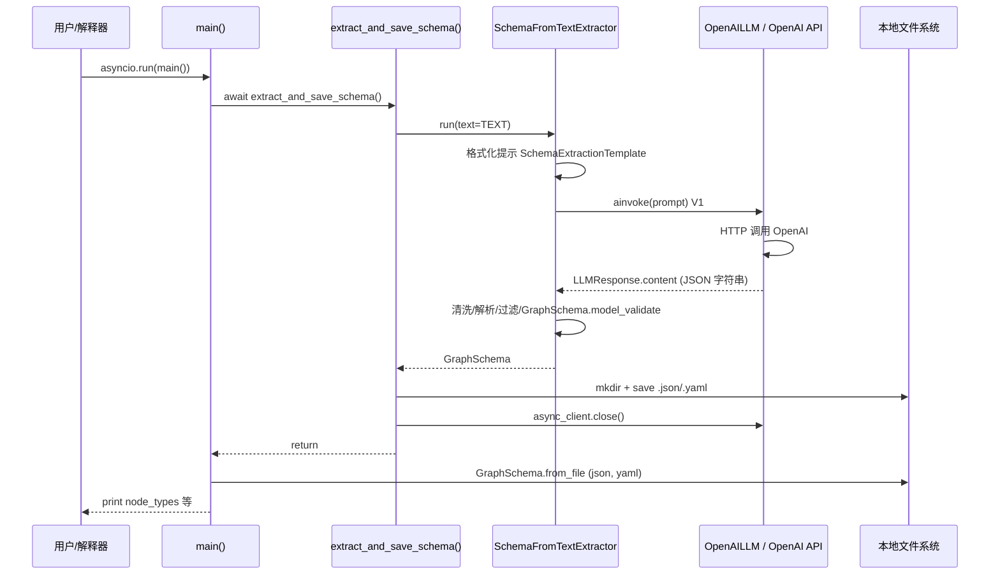
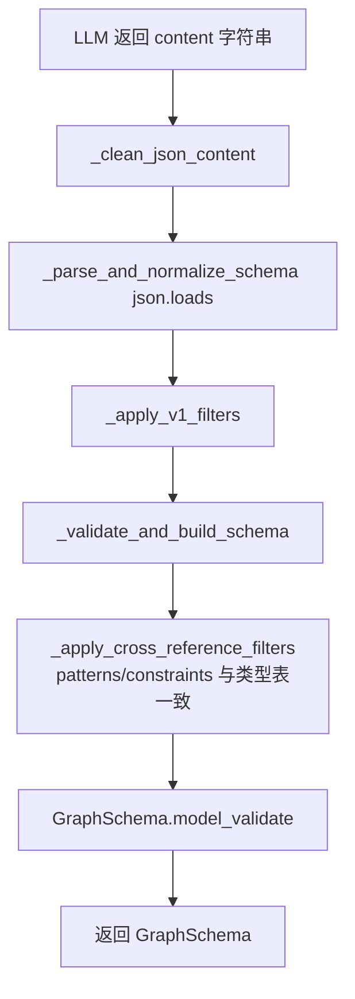
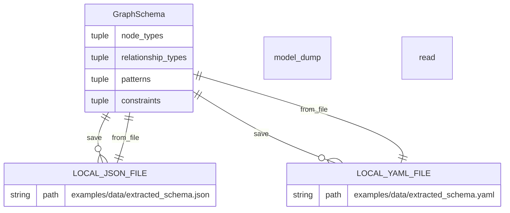

# schema_from_text.py 示例脚本入口解读（`asyncio.run(main)`）

**分析锚点**：`examples/customize/build_graph/components/schema_builders/schema_from_text.py` 第 129～131 行（`if __name__ == "__main__"` 与 `asyncio.run(main())`），并纵向下钻至 `main` → `extract_and_save_schema` 及库内 `SchemaFromTextExtractor` / `GraphSchema` / `OpenAILLM`。

---

## 1. 入口与入参解析

| 内容 | 说明 |
|------|------|
| **入口说明** | **CLI/脚本入口**：以 `python schema_from_text.py`（或等价方式）直接执行该文件时，通过标准 Python 的 `__main__` 块启动异步主协程。在仓库中的角色是 **演示**：用 LLM 从自然语言文本推断图模式（`GraphSchema`），落盘为 JSON/YAML，再读回校验。 |
| **进入条件** | 解释器以该文件为 `__main__` 模块执行；无额外路由或权限。实际能否跑通依赖：**环境变量**（示例要求 `.env` 中配置 **OpenAI API Key**，见文件头注释）、本机可访问 OpenAI API、已安装带 `openai` 的依赖（`neo4j-graphrag[openai]`）。 |
| **入参形态与格式** | 本入口 **无命令行参数**；驱动流程的是模块级常量：`TEXT`（待抽取模式的样本文本）、`OUTPUT_DIR` / `JSON_FILE_PATH` / `YAML_FILE_PATH`（由 `Path(__file__).parents[4]` 推导，见下文）。 |
| **参数逻辑** | **必要隐含参数**：有效的 OpenAI 凭证与网络。**影响分支的字段**：本示例未传入 `SchemaFromTextExtractor(..., use_structured_output=True)`，故走 **V1 基于提示词的 JSON 抽取**（而非 V2 结构化输出）。`TEXT` 的内容直接决定 LLM 推断出的节点类型、关系类型与模式；`llm_model_params` 中的 `response_format: json_object` 与 `temperature: 0` 约束输出形态与稳定性。 |

**路径说明（影响出参落盘位置）**：

- `root_dir = Path(__file__).parents[4]` 解析为仓库下的 **`examples/`** 目录（不是仓库根目录）。
- 因此输出目录为 **`examples/data/`**，文件为 `extracted_schema.json` 与 `extracted_schema.yaml`。

---

## 2. 出参、数据变更与外部依赖

| 内容 | 说明 |
|------|------|
| **出参** | **控制台标准输出**：进度文案、`GraphSchema` 摘要（节点类型列表、关系类型列表、`patterns` 三元组循环打印）、保存路径提示、从文件读回后的 `node_types` 列表。**无 HTTP 响应体**。若中途抛错，Python 正常回溯；`extract_and_save_schema` 在 `finally` 中仍会尝试关闭异步客户端。 |
| **存储变更** | **本地文件系统**：在 `examples/data/` 下 **创建目录**（若不存在）、**写入/覆盖** `extracted_schema.json` 与 `extracted_schema.yaml`（`GraphSchema.save(..., overwrite=True)`）。**不涉及 Neo4j**、不涉及其它业务数据库。 |
| **外部依赖** | **OpenAI Chat Completions API**（经 `OpenAILLM` 异步调用）：**读型语义上对密钥侧计费/写审计之外无业务库写入**；对调用方而言是一次**远程推理请求**，返回模型生成的 JSON 文本。**待确认**：具体企业代理/重试策略取决于 `OpenAILLM`/`RateLimitHandler` 配置（未在本示例中显式传入）。 |
| **其它副作用** | `logging.basicConfig()` + 将 `neo4j_graphrag` logger 设为 INFO；`load_dotenv()` 加载 `.env`。 |

---

## 3. 流程

### 3.1 核心流程概括

脚本启动后，`asyncio.run(main())` 调度异步入口 `main`。`main` 首先调用 `extract_and_save_schema`：构造带 JSON 输出约束的 `OpenAILLM`，用默认提示模板实例化 `SchemaFromTextExtractor`，对固定常量 `TEXT` 调用 `run` 得到不可变的 `GraphSchema`；确保 `examples/data/` 存在后将同一对象分别保存为 JSON 与 YAML；打印摘要后在 `finally` 中关闭 LLM 异步 HTTP 客户端。随后 `main` 用 `GraphSchema.from_file` 分别从两个文件反序列化，打印两侧 `node_types` 以验证读写一致。整条链路 **不向 Neo4j 建图或查询**。

### 3.2 纵向链路（入口 → 边界）

1. **`schema_from_text.py`：`if __name__ == "__main__"`** → 调用 **`asyncio.run(main)`**，在事件循环中执行 `main`。
2. **`main()`** → **`await extract_and_save_schema()`**；完成后打印保存路径；再 **`GraphSchema.from_file(JSON_FILE_PATH)`** 与 **`GraphSchema.from_file(YAML_FILE_PATH)`**，打印两边的 `list(...node_types)`。
3. **`extract_and_save_schema()`** → 构造 **`OpenAILLM(model_name="gpt-5", model_params=...)`**（合并 `max_tokens`、`response_format`、`temperature` 等）。
4. **`SchemaFromTextExtractor(llm=llm)`**（默认 **`SchemaExtractionTemplate`**、`use_structured_output=False`）。
5. **`await schema_extractor.run(text=TEXT)`**（`experimental/components/schema.py`）  
   - 使用 **`SchemaExtractionTemplate.format(text=..., examples=...)`** 得到提示串。  
   - **V1 路径**：**`await self._llm.ainvoke(prompt, **self._llm_params)`** → `BaseOpenAILLM` 对 **字符串** 输入走 **`__ainvoke_v1`**，向 OpenAI 发聊天补全请求。  
   - 响应正文经 **`_clean_json_content`**（去 markdown 代码块包裹）、**`_parse_and_normalize_schema`**（`json.loads`，列表兜底取首元素字典）、**`_apply_v1_filters`**（无 label 的节点/边过滤、`required` 字段清洗、无属性节点剔除等）。  
   - **`_validate_and_build_schema`**：跨引用过滤（**`_apply_cross_reference_filters`**：模式与约束与节点/关系类型一致）、**`GraphSchema.model_validate(...)`** 得到 **`GraphSchema`**。
6. **`Path(OUTPUT_DIR).mkdir(exist_ok=True)`** → **`inferred_schema.save(JSON_FILE_PATH, overwrite=True)`** / **`save(YAML_FILE_PATH, overwrite=True)`** → **`GraphSchema.model_dump(mode="json")`** + **`FileHandler.write`**（按扩展名写 JSON 或 YAML）。
7. **`finally: await llm.async_client.close()`** → 释放异步 OpenAI 客户端连接。
8. **`GraphSchema.from_file`** → **`FileHandler.read`** + **`cls.model_validate(data)`**，与步骤 5 的校验规则一致。

### 3.3 流程图 / 时序图

**总览（从脚本入口到外部边界）**：下图覆盖 `asyncio.run(main)` 起，经提取组件与 OpenAI，再到本地文件与读回验证的主成功路径。

**子流程：V1 抽取在库内如何落地为 `GraphSchema`（与 3.2 步骤 5 对齐）**

---

## 4. 实体清单与关系

| 小节 | 内容 |
|------|------|
| **关键实体清单** | **`GraphSchema`（内存/Pydantic）**：`node_types`、`relationship_types`、`patterns`、`constraints` 等，用于描述「允许的」节点标签、关系类型及可选模式三元组。**本地文件**：`examples/data/extracted_schema.json`、`.yaml`，内容为 `GraphSchema` 的 JSON 兼容序列化。 |
| **关系与约束** | 文件与内存对象 **一对一** 对应：保存为 `model_dump(mode="json")`，加载为 `model_validate`。`GraphSchema` 冻结模型；若存在 `patterns`，校验要求 `relationship_types` 非空且模式中引用的标签必须在 `node_types`/`relationship_types` 中定义（见库内校验器）。 |
| **关系图** | 本示例 **不涉及 Neo4j 节点/关系**；仅为「文本 → LLM → `GraphSchema` → 磁盘文件」。 |

| 小节 | 内容 |
|------|------|
| **数据转换链** | `TEXT`（str）→ 提示模板（str）→ OpenAI 返回 JSON 字串 → dict 归一化与过滤 → **`GraphSchema`** → 文件（JSON/YAML）→ 再次 **`GraphSchema`**。 |
| **字段说明** | 对 **OpenAI 请求**：`model_params` 中的 `response_format` 与 `temperature` 影响输出可解析性与随机性。对 **`GraphSchema`**：`patterns` 为 `(source_label, relationship_label, target_label)` 语义三元组；与 Neo4j 中实际图数据无直接绑定，仅为模式描述。 |

---

## 5. 用例

- **入参（隐式）**：`TEXT` 为文件中关于 Acme 公司与雇员的英文段落；环境已配置 `OPENAI_API_KEY`（变量名以实际 `openai` 库与项目约定为准，示例依赖 `.env`）。
- **内部关键变化**：`SchemaFromTextExtractor.run` 调用 OpenAI，返回 `GraphSchema`；写入 `examples/data/extracted_schema.json` 与 `.yaml`；`async_client` 关闭；`from_file` 两次加载，打印 JSON/YAML 中 `node_types` 列表（预期内容结构一致，可能因 YAML/JSON 序列化细节在键顺序上表现不同，但解析后对象等价）。
- **出参**：终端打印节点类型名列表、关系类型与 `patterns`（若有）；最后输出「已从文件加载」的 `node_types` 列表。

---

## 6. 其它技术与横切关注点（收尾）

| 类别 | 说明 |
|------|------|
| **异步** | 入口使用 **`asyncio.run`** 驱动 **`async def main`**；与 OpenAI 的交互走 **`ainvoke`**。 |
| **资源** | **`try/finally`** 保证在提取保存后关闭 **`llm.async_client`**，避免连接泄漏。 |
| **错误** | LLM 或 JSON 解析失败时可能抛出 **`LLMGenerationError`**、**`SchemaExtractionError`**、**`SchemaValidationError`** 等（库内定义）；本脚本未单独捕获，由进程级异常输出。 |
| **模型名** | 代码写死 **`gpt-5`**；若该标识在部署环境中不可用，需替换为实际可用模型名（**待确认**：用户侧 OpenAI 账户支持的模型列表）。 |
| **安全** | API Key 来自环境变量，不应硬编码；日志级别 INFO 可能输出组件内部信息，生产场景需按需降级。 |

**待确认**：

- 各环境下 **`gpt-5`** 是否可用及计费/速率限制策略。
- 是否需在 CI 中跳过该示例（依赖外网与密钥）——由项目维护策略决定，非本文件能确定。

---

## 自检（对照 analizy-code）

- [x] 第 1 节：入口、`__main__` 条件、无 CLI 参数、环境依赖与 V1/V2 分支说明。  
- [x] 第 2 节：stdout、本地文件读写、OpenAI 外部调用。  
- [x] 第 3 节：概括 + 纵向链路至 `GraphSchema` 与 `FileHandler` + Mermaid。  
- [x] 第 4 节：`GraphSchema` 与文件 ER、数据链。  
- [x] 第 5 节：完整用例一条。  
- [x] 第 6 节：异步、资源、异常、待确认模型名。  
- [x] 已落盘：`ai_docs/26041501-schema_from_text-示例入口解读.md`。
