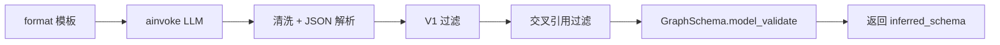

# schema_from_text：磁盘文件生成逻辑下钻

## 开头

- **范围**：示例脚本中三处锚点——`SchemaFromTextExtractor(llm=llm)`（约 77～78 行）、`await schema_extractor.run(text=TEXT)`（约 81～82 行）、`inferred_schema.save(JSON_FILE_PATH, overwrite=True)`（约 88～89 行）——所构成的 **「内存中的 `GraphSchema` → 序列化 → 写入本地文件」** 全链路；YAML 第二次 `save` 与 JSON **共用同一套生成与写入逻辑**，仅扩展名不同。
- **基线**：总览级说明见 [`26041501-schema_from_text-示例入口解读.md`](./26041501-schema_from_text-示例入口解读.md)。
- **主路径一句话**：先由抽取器经 LLM 与校验得到 **`GraphSchema` 实例**，再 **`model_dump(mode="json")` 得到可 JSON 化的 dict**，最后经 **`FileHandler.write`** 按扩展名选 **JSON 或 YAML 编码** 写入磁盘；**覆盖写**由 `overwrite=True` 与 `_check_file_can_be_written` 共同允许。

---

## 总览：字段族合并

| 合并组 | 说明 |
|--------|------|
| **`inferred_schema` 的内容从哪来** | 仅与 **`run(text=TEXT)`** 有关：模板拼提示 → OpenAI 返回字符串 → 解析/过滤 → **`GraphSchema.model_validate`**。与 `save` 无数据再加工（`save` 只做序列化）。 |
| **写入磁盘的字节从哪来** | 仅与 **`GraphSchema.save`** + **`FileHandler`** 有关：`model_dump(mode="json")` 提供 **dict**，**不写 Neo4j、不经 LLM**。 |
| **JSON 与 YAML 两文件** | **同一 `inferred_schema` 对象** 调用两次 `save`，路径不同、**格式由文件扩展名推断**（`.json` / `.yaml`），序列化细节（`json.dump` vs `yaml.safe_dump`）不同。 |

---

## 1. 时序图（从三处锚点到落盘）

**说明**：先沿 **Extractor 构造 → run 得到 `GraphSchema` → save** 看主泳道；**目录创建**（`mkdir`）在示例中发生在第一次 `save` 之前，保证父路径存在。

```mermaid
sequenceDiagram
    participant Ex as schema_from_text.py
    participant SE as SchemaFromTextExtractor
    participant PT as SchemaExtractionTemplate
    participant LLM as OpenAILLM / OpenAI
    participant GS as GraphSchema
    participant FH as FileHandler
    participant FS as 本地文件系统

    Ex->>SE: __init__(llm=llm)
    Note over SE: 保存 _llm、默认模板、use_structured_output=False

    Ex->>SE: run(text=TEXT)
    SE->>PT: format(text=TEXT, examples="")
    PT-->>SE: prompt 字符串
    SE->>LLM: ainvoke(prompt) V1
    LLM-->>SE: LLMResponse.content
    SE->>SE: 清洗 JSON、解析、V1 过滤、交叉引用过滤
    SE->>GS: model_validate(...)
    GS-->>SE: inferred_schema

    Ex->>Ex: mkdir(OUTPUT_DIR, exist_ok=True)
    Ex->>GS: save(JSON_FILE_PATH, overwrite=True)
    GS->>GS: model_dump(mode="json")
    GS->>FH: write(data, path, overwrite=True)
    FH->>FH: _guess_file_format -> JSON
    FH->>FS: open(path,"w"); json.dump(..., indent=2)

    Ex->>GS: save(YAML_FILE_PATH, overwrite=True)
    GS->>GS: model_dump(mode="json")
    GS->>FH: write(data, path, overwrite=True)
    FH->>FH: _guess_file_format -> YAML
    FH->>FS: open(path,"w"); yaml.safe_dump(...)
```

---

## 2. 按锚点展开：计算与分支

### 2.1 `SchemaFromTextExtractor(llm=llm)`（77～78 行）

- **职责**：构造抽取器，**不触发网络、不写文件**。
- **状态**：`self._llm = llm`；`self._prompt_template` 默认为 **`SchemaExtractionTemplate()`**（`generation/prompts.py` 中大段英文指令 + 「Return a valid JSON object…」结构说明）；`self._llm_params` 默认为 `{}`；**`use_structured_output=False`**（本示例未传参），故后续 `run` 走 **V1 提示词 + JSON 文本解析**。
- **与落盘的关系**：**无直接写盘**；仅决定 **`run` 如何得到 dict 再变成 `GraphSchema`**。

### 2.2 `await schema_extractor.run(text=TEXT)`（81～82 行）

**文字流程（V1，与示例一致）**：

1. **`prompt = self._prompt_template.format(text=text, examples=examples)`**  
   - 将 **`TEXT`** 嵌入模板末尾 「Input text:」段，得到发给模型的完整字符串。
2. **`await self._llm.ainvoke(prompt, **self._llm_params)`**  
   - `OpenAILLM` 对 **str** 走异步 V1 路径，向 **OpenAI** 请求聊天补全；示例在构造 LLM 时传入的 **`model_params`**（如 `response_format`、`temperature`）影响请求体，**不在本行显式出现**。
3. **`_clean_json_content` → `_parse_and_normalize_schema`**：`json.loads`；若顶层是 list 则取第一个 dict。
4. **`_apply_v1_filters`**：去掉无 label 的节点/关系、规范化 `required`、去掉无属性的节点等。
5. **`_validate_and_build_schema`**：**`_apply_cross_reference_filters`**（patterns/constraints 与 node/rel 类型表一致）→ **`GraphSchema.model_validate({...})`**。
6. **返回**：不可变 **`GraphSchema`** 实例，赋给 **`inferred_schema`**。

**与落盘的关系**：此处产出 **内存对象**；文件内容在语义上等于该对象经 Pydantic **`model_dump`** 后的结构化数据（再经 JSON/YAML 编码）。

可选流程图（仅 `run` 内部）：



### 2.3 `inferred_schema.save(JSON_FILE_PATH, overwrite=True)`（88～89 行）及 YAML

**前置（同脚本内、紧挨在 save 前）**：**`Path(OUTPUT_DIR).mkdir(exist_ok=True)`** 创建 **`examples/data/`**（若不存在）。**`save` 本身不创建父目录**；若省略 `mkdir` 且目录不存在，打开文件时会失败。

**`GraphSchema.save`（`schema.py`）**：

1. **`data = self.model_dump(mode="json")`**  
   - 将 **`GraphSchema`**（及嵌套的 `NodeType`、`PropertyType` 等）转为 **可 JSON 序列化的 dict**（Pydantic v2 语义；模式为 json 兼容类型）。
2. **`FileHandler().write(data, file_path, overwrite=overwrite, format=format)`**  
   - 本示例 **`format=None`**，由路径扩展名推断。

**`FileHandler.write`（`file_handler.py`）**：

1. **`path = Path(file_path)`**。
2. **`_check_file_can_be_written(path, overwrite)`**  
   - **`overwrite=True`**：直接返回，**允许覆盖已存在文件**。
   - **`overwrite=False`** 且文件已存在：抛 **`ValueError("File already exists...")`**。
3. **`_guess_file_format(path)`**：`.json` → **`FileFormat.JSON`**；`.yaml`/`.yml` → **`YAML`**；其它扩展名 → **`None`**，随后 **`Unsupported file format`**。
4. **JSON**：**`_write_json`** → `fs.open(fp, "w")`，**`json.dump(data, f, indent=2)`**（默认 indent 为 2）。
5. **YAML**：**`_write_yaml`** → **`yaml.safe_dump`**，默认 **`default_flow_style=False`**、**`sort_keys=True`**（键排序与 JSON  dump 顺序可能不同，但反解析回 `GraphSchema` 仍应等价）。

**同一对象两次 `save`**：先 **`JSON_FILE_PATH`**，再 **`YAML_FILE_PATH`**；两次均 **`model_dump`**，内容同源；**第二次覆盖**仅影响 YAML 路径上的文件。

---

## 3. 自检

- **合并**：JSON/YAML 两条落盘路径已在「总览」与「2.3」合并说明，避免重复两张时序图。
- **不确定 / 待核对**  
  - **模型输出随机性**：即使 `temperature=0`，不同模型版本仍可能导致 **`inferred_schema` 略有差异**，从而磁盘文件内容变化。  
  - **父目录**：仅当脚本执行过 **`mkdir`** 时保证 **`examples/data/`** 存在；若单独调用 **`save`** 到无父目录路径，行为依赖 **fsspec/本地 FS**（通常报错）。  
  - **`_write_json` 文档字符串** 提到 `indent=4` 为例，**实现为 `indent=2`**，以源码为准。

---

## 源码索引（便于跳转）

| 符号 | 路径 |
|------|------|
| `SchemaFromTextExtractor.__init__` / `run` | `src/neo4j_graphrag/experimental/components/schema.py` |
| `SchemaExtractionTemplate` | `src/neo4j_graphrag/generation/prompts.py` |
| `GraphSchema.save` | `src/neo4j_graphrag/experimental/components/schema.py` |
| `FileHandler.write` / `_write_json` / `_write_yaml` / `_check_file_can_be_written` | `src/neo4j_graphrag/utils/file_handler.py` |
| 示例中的路径与 `save` 调用 | `examples/customize/build_graph/components/schema_builders/schema_from_text.py` |
