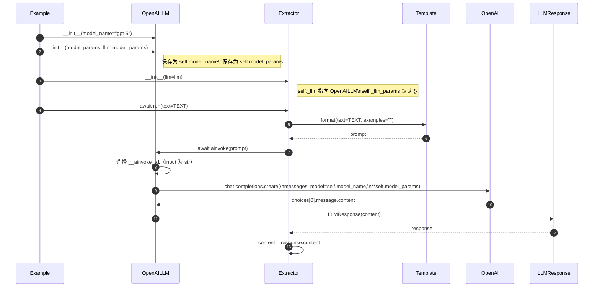

# schema_from_text：OpenAILLM 参数注入与调用链路下钻

## 开头

- **范围**：下钻你指定链路  
  `schema_from_text.py:70-73` -> `schema_from_text.py:77-78` -> `schema_from_text.py:81-82` -> `schema.py:1210-1211`。  
- **目标**：说明 `model_name/model_params` 如何从 `OpenAILLM(...)` 进入对象，如何被 `SchemaFromTextExtractor` 间接使用，最后如何完成一次真实模型调用并拿到 `response.content`。
- **主路径一句话**：`OpenAILLM` 在初始化时保存 `model_name/model_params`，`SchemaFromTextExtractor.run` 走 V1 分支调用 `self._llm.ainvoke(prompt)`，`OpenAILLM.__ainvoke_v1` 用 `self.model_name + self.model_params` 直接发起 `async_client.chat.completions.create(...)`，返回后包装成 `LLMResponse(content=...)`，最终在 `schema.py:1210` 读取 `response.content`。

---

## 总览（可合并逻辑）

| 组 | 说明 |
|---|---|
| **参数注入组** | `model_name="gpt-5"` + `model_params=llm_model_params` 在 `OpenAILLM.__init__` 一次性落入实例字段。 |
| **组件装配组** | `SchemaFromTextExtractor(llm=llm)` 只保存 `self._llm` 引用，不复制/改写 `OpenAILLM.model_params`。 |
| **调用与返回组** | `run(text)` -> `_run_with_prompt_based_extraction` -> `self._llm.ainvoke(prompt, **self._llm_params)` -> `OpenAILLM.__ainvoke_v1` -> OpenAI API -> `LLMResponse(content)` -> `schema.py:1210 content = response.content`。 |

---

## 1) 时序图：参数从构造到 `response.content`

---

## 2) 按代码链路展开（怎么算）

### 2.1 `schema_from_text.py:70-73` 参数进入 OpenAILLM

代码传入：

- `model_name="gpt-5"`
- `model_params=llm_model_params`，其中包括：`max_tokens`、`response_format={"type":"json_object"}`、`temperature`

进入 `OpenAILLM` 后的落点：

1. `OpenAILLM.__init__` 调用 `super().__init__(model_name=model_name, model_params=model_params, ...)`。  
2. `BaseOpenAILLM.__init__` 再调用 `LLMInterfaceV2.__init__(...)`。  
3. `LLMInterfaceV2.__init__` 把参数写入：
   - `self.model_name = model_name`
   - `self.model_params = model_params or {}`
4. `OpenAILLM.__init__` 还会创建：
   - `self.client = openai.OpenAI(...)`
   - `self.async_client = openai.AsyncOpenAI(...)`

**结论**：你在 `71-72` 传入的模型基础参数会长期挂在 `llm` 实例的 `self.model_name / self.model_params`，后续调用直接读取。

---

### 2.2 `schema_from_text.py:77-78` 被 `SchemaFromTextExtractor` 初始化后发生了什么

`SchemaFromTextExtractor.__init__(llm=llm)` 做三件关键事：

1. `self._llm = llm`：只保存同一个 `OpenAILLM` 对象引用。  
2. `self._prompt_template = SchemaExtractionTemplate()`（默认模板）。  
3. `self._llm_params = llm_params or {}`。示例未传 `llm_params`，所以它是 `{}`。

这意味着：

- 抽取器不会覆盖 `llm.model_params`。  
- 运行时调用 `self._llm.ainvoke(prompt, **self._llm_params)` 时，`**self._llm_params` 在本例为空，不会新增参数。

---

### 2.3 `schema_from_text.py:81-82` 到 `schema.py:1210-1211` 的真实调用链

`await schema_extractor.run(text=TEXT)` 的关键路径：

1. `run()` 先 `prompt = self._prompt_template.format(text=text, examples=examples)`。  
2. 因 `use_structured_output=False`，走 `_run_with_prompt_based_extraction(prompt)`。  
3. 在 `_run_with_prompt_based_extraction` 中：
   - `response = await self._llm.ainvoke(prompt, **self._llm_params)`
   - `content = response.content`（你指的 `schema.py:1210`）
4. `self._llm` 是 `OpenAILLM`，输入是 `str`，因此 `BaseOpenAILLM.ainvoke` 走 `__ainvoke_v1` 分支。
5. `OpenAILLM.__ainvoke_v1` 发起真正请求：
   - `messages=self.get_messages(input, ...)`
   - `model=self.model_name`
   - `**self.model_params`
6. OpenAI 返回后，代码取 `response.choices[0].message.content or ""`，包装成 `LLMResponse(content=...)` 返回给 `SchemaFromTextExtractor`。
7. `SchemaFromTextExtractor` 再做清洗与校验：`_clean_json_content` -> `_parse_and_normalize_schema` -> `_apply_v1_filters` -> `_validate_and_build_schema`。

---

## 3) 参数拼装细节（你关心的“基础参数是怎么被用掉的”）

### 3.1 在 V1（本例）里的最终请求参数来源

最终传给 `async_client.chat.completions.create(...)` 的核心参数：

- `model` <- `self.model_name`（来自 `OpenAILLM(model_name=...)`）
- 其它模型参数 <- `**self.model_params`（来自 `OpenAILLM(model_params=...)`）

所以本例的 `response_format={"type":"json_object"}`、`max_tokens`、`temperature` 都是通过 `self.model_params` 进入 OpenAI SDK 调用。

### 3.2 与 `SchemaFromTextExtractor._llm_params` 的关系

- 本例 `SchemaFromTextExtractor._llm_params == {}`，因此不会向 `ainvoke` 额外注入参数。  
- 即使传了 `_llm_params`，`BaseOpenAILLM.ainvoke(str)` 走的是 `__ainvoke_v1(input, message_history, system_instruction)`，该分支本身不接收 `**kwargs`，额外参数并不会参与底层 API 调用。  
- 因此 **本例真正生效的模型参数来源是 `OpenAILLM.model_params`**，不是 extractor 的 `_llm_params`。

---

## 4) 异常与重试（补充横切）

- `__ainvoke_v1` 捕获 `openai.OpenAIError` 并抛出 `LLMGenerationError`。  
- 该方法被 `@async_rate_limit_handler_decorator` 包装：默认 `DEFAULT_RATE_LIMIT_HANDLER = RetryRateLimitHandler()`，可对可重试异常应用指数退避重试。  
- 在 `schema.py:1211`，`SchemaFromTextExtractor` 捕获 `LLMGenerationError` 并重新抛出带业务语义的信息。

---

## 自检与待确认

- [x] 已覆盖你指定的 4 个锚点，并闭环到 `response.content`。
- [x] 已说明 `71-72` 参数如何落到 `self.model_name/self.model_params`。
- [x] 已说明 `SchemaFromTextExtractor` 初始化只保留引用、不改写 `OpenAILLM` 参数。
- [x] 已说明最终 API 调用处参数拼装位置（`__ainvoke_v1`）。

**待确认**：

- `response_format={"type":"json_object"}` 是否被目标模型完全支持，取决于模型与 OpenAI API 兼容能力；代码层面会继续走 JSON 解析与校验兜底。

---

## 源码索引

- `examples/customize/build_graph/components/schema_builders/schema_from_text.py`
- `src/neo4j_graphrag/llm/openai_llm.py`
- `src/neo4j_graphrag/llm/base.py`
- `src/neo4j_graphrag/experimental/components/schema.py`
- `src/neo4j_graphrag/generation/prompts.py`
- `src/neo4j_graphrag/utils/rate_limit.py`
